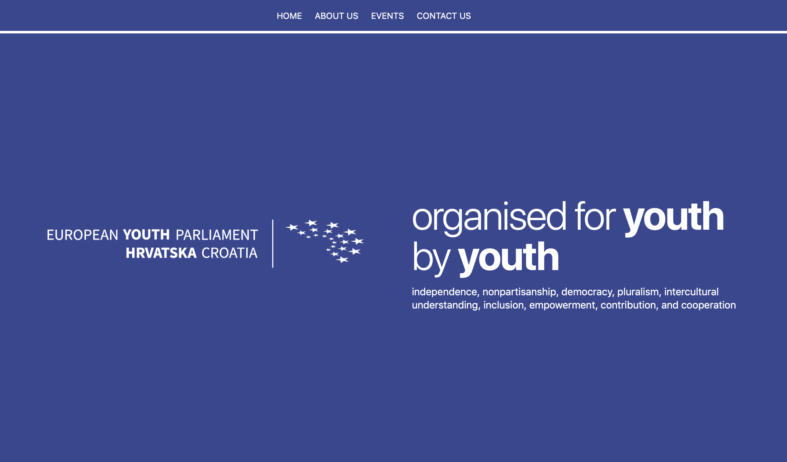

This theme was based on a Jekyll theme called [uBuild](https://github.com/forestryio/ubuild-jekyll), which was designed to use Forestry's Blocks feature to create modular page layouts.

It is designed to work with [Forestry](https://forestry.io/)'s [Blocks](https://forestry.io/blog/blocks-give-your-editors-the-power-to-build-pages/) feature.  This theme provides a set of page-level components and a pre-configured Forestry Blocks UI that will empower content editors to construct their own webpages. 

[View the announcement post on Forestry.io about uBuild.](https://forestry.io/blog/ubuild-a-new-theme-for-static-sites-using-blocks/#/)

